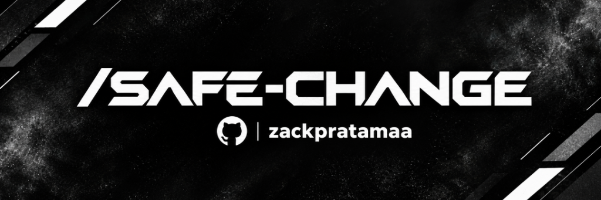

<div align="center">



<br/>

[](https://github.com/zackpratamaa/safe-change)

<br/>

[](https://github.com/sponsors/zackpratamaa)
[](https://www.npmjs.com/package/safe-change)
[](https://www.npmjs.com/package/safe-change)
[](https://github.com/zackpratamaa/safe-change/actions)
[](LICENSE)
[](https://nodejs.org)

</div>

<br/>

---

<br/>

## Why safe-change exists

You give an AI agent a task. It edits twelve files, installs two packages, and reorganizes a folder. The app still starts. But login is broken — and you have no idea which of those twelve changes caused it.

Without a recorded baseline, every regression is a mystery. Every follow-up prompt is a guess.

**safe-change records what was passing before the agent worked, then tells you exactly what broke after.**

No cloud. No API key. No model. One command before, one command after.

<br/>

---

<br/>

## How it works

```bash
# Step 1 — Before the agent: lock in a verified baseline
safe-change save "auth and dashboard both passing"

# Step 2 — Let your agent do its work
# ...

# Step 3 — After the agent: detect what regressed
safe-change check

# Step 4 — See which files were touched
safe-change diff
```

```
Baseline: auth and dashboard both passing

Check             Before    Now       Result
─────────────────────────────────────────────
build             pass      pass      ok
unit-tests        pass      fail      REGRESSION
e2e-auth          pass      pass      ok

Files changed since baseline:
  Modified:  8
  Added:     2
  Deleted:   0

Exit 1 — 1 new regression detected.
Previously passing check now fails: unit-tests
```

<br/>

---

<br/>

## Install

```bash
npm install -g safe-change
```

```bash
# Verify
safe-change --version
```

> Node.js ≥ 18. No build step. No compiler. No cloud account.

<br/>

---

<br/>

## Quick start

**1. Create `.safe-change.json` in your project root**

```json
{
  "version": 1,
  "checks": [
    {
      "name": "build",
      "executable": "npm",
      "args": ["run", "build"],
      "timeout": 60
    },
    {
      "name": "test",
      "executable": "npm",
      "args": ["test"],
      "timeout": 120
    }
  ]
}
```

**2. Save a baseline before your agent starts**

```bash
safe-change save "before refactor"
```

**3. Check for regressions after your agent finishes**

```bash
safe-change check
```

**4. Inspect which files changed**

```bash
safe-change diff
```

<br/>

---

<br/>

## Commands

| Command | What it does |
|---|---|
| `save [description]` | Record a baseline — runs all checks, hashes all files |
| `check` | Compare current state to baseline — exit 1 if regression |
| `diff` | List files added, modified, or deleted since baseline |
| `log` | Full history of baselines and check results |
| `dashboard` | Open visual dashboard at `localhost:4242` |
| `rules list` | Show active safety rules |
| `rules add <id>` | Add a built-in safety rule |
| `rules remove <id>` | Remove a safety rule |
| `install <agent\|all>` | Install skill for a specific agent or all detected agents |
| `update <agent\|all>` | Update installed skill to latest |
| `uninstall <agent\|all>` | Remove installed skill |
| `status [agent]` | Show install status, detected agents, drift |
| `mcp` | Start MCP server on stdio |

All commands accept `--json` for structured output and `--help` for usage details.
Installer commands accept `--scope <project|global>`, `--dry-run`, and `--overwrite`.

<br/>

---

<br/>

## Supported agents

```bash
# Detect which agents are installed and set up all of them at once
safe-change install all
```

| Agent | ID | Project scope | Global scope |
|---|---|---|---|
| Google Antigravity | `antigravity` | `.agents/skills/safe-change/` | `~/.gemini/config/skills/safe-change/` |
| Claude Code | `claude-code` | `.claude/skills/safe-change/` | `~/.claude/skills/safe-change/` |
| Cursor | `cursor` | `.cursor/skills/safe-change/` | `~/.cursor/skills/safe-change/` |
| OpenAI Codex | `codex` | `.codex/skills/safe-change/` | `~/.codex/skills/safe-change/` |
| Cline | `cline` | `.cline/skills/safe-change/` | `~/.cline/skills/safe-change/` |
| Kimi Code | `kimi-code` | `.kimi-code/skills/safe-change/` | `~/.kimi-code/skills/safe-change/` |
| Amp | `amp` | `.agents/skills/safe-change/` | `~/.config/agents/skills/safe-change/` |
| OpenCode | `opencode` | `.opencode/skills/safe-change/` | `~/.config/opencode/skills/safe-change/` |
| Gemini CLI | `gemini-cli` | `.gemini/skills/safe-change/` | `~/.gemini/skills/safe-change/` |
| GitHub Copilot | `github-copilot` | `.github/skills/safe-change/` | `~/.github/skills/safe-change/` |

All agents ship with `filesystem-validated` status. Runtime verification is ongoing.

<br/>

---

<br/>

## MCP server

Agents that support the Model Context Protocol can invoke safe-change as a native tool — no SKILL.md, no manual setup, no PATH configuration needed.

```bash
safe-change mcp
```

Add this to your agent's MCP config:

```json
{
  "mcpServers": {
    "safe-change": {
      "command": "safe-change",
      "args": ["mcp"]
    }
  }
}
```

**Exposed tools:**

| Tool | Description |
|---|---|
| `safe_change_save` | Record a baseline before edits |
| `safe_change_check` | Detect regressions after edits |
| `safe_change_diff` | Get file-level change summary |
| `safe_change_status` | Show current baseline metadata |
| `safe_change_log` | Retrieve project safety history |

Full per-agent setup in [docs/mcp-setup.md](docs/mcp-setup.md).

<br/>

---

<br/>

## Safety rules

Automatically enforce guardrails on every `safe-change check`.

```bash
safe-change rules add no-delete-migrations
safe-change rules add no-modify-lockfile
safe-change rules add max-files-changed --limit 50 --severity warn
safe-change rules add require-tests-pass
```

| Rule ID | What it enforces |
|---|---|
| `no-delete-migrations` | Blocks deletion of `**/migrations/**` |
| `no-delete-env` | Blocks deletion of `**/.env*` |
| `no-modify-lockfile` | Blocks lockfile modification |
| `max-files-changed` | Fails or warns when too many files change |
| `max-deleted-files` | Fails or warns when too many files are deleted |
| `require-tests-pass` | Requires a named check to have passed at baseline |

Rule violations with `severity: error` set exit code 1, same as a regression.

<br/>

---

<br/>

## Local dashboard

```bash
safe-change dashboard
# Dashboard running at http://localhost:4242
# Press Ctrl+C to stop.
```

Fully offline. Binds to `localhost` only — never exposed to the network. Shows:

- Current baseline status and metadata
- Full history log with timestamps and descriptions
- Regression timeline — green dots clean, red dots regressions
- Active safety rules and their last evaluation

<br/>

---

<br/>

## Safety model

safe-change is built to never be the cause of a regression.

| Guarantee | Detail |
|---|---|
| No silent Git mutations | Never runs `git commit`, `git stash`, `git reset`, or `git clean` |
| No working tree writes | Reads and hashes files only — never modifies your project files |
| No telemetry | Zero outbound network calls. Fully offline. |
| No shell expansion | Commands are spawned directly. No shell interpolation. |
| No AI dependency | No model, no API key, no account required |
| Bounded execution | Configurable timeouts on all check processes |

See [SECURITY.md](SECURITY.md) for trust boundaries and vulnerability reporting.

<br/>

---

<br/>

## Exit codes

| Code | Meaning |
|---|---|
| `0` | Clean — no new regressions |
| `1` | Regression — at least one previously passing check now fails |
| `2` | No baseline found or baseline is corrupt |
| `3` | Configuration error |
| `4` | Not a Git repository |
| `5` | Internal error |
| `6` | Cancelled by user |
| `7` | Collision — use `--overwrite` to proceed |
| `8` | Ownership conflict |
| `9` | Unsupported agent or incompatible target |

<br/>

---

<br/>

## Documentation

| File | Contents |
|---|---|
| [GUIDE.md](GUIDE.md) | Full setup, usage, and troubleshooting |
| [ROADMAP.md](ROADMAP.md) | Shipped milestones and what is next |
| [CONTRIBUTING.md](CONTRIBUTING.md) | How to contribute |
| [SECURITY.md](SECURITY.md) | Trust model and vulnerability reporting |
| [docs/mcp-setup.md](docs/mcp-setup.md) | MCP configuration per agent |
| [docs/rules.md](docs/rules.md) | Safety rules reference |
| [docs/dashboard.md](docs/dashboard.md) | Dashboard guide |
| [docs/persistent-log.md](docs/persistent-log.md) | Persistent safety log |
| [skills/safe-change/SKILL.md](skills/safe-change/SKILL.md) | Canonical agent skill |

<br/>

---

<br/>

## Star history

<div align="center">

[](https://star-history.com/#zackpratamaa/safe-change&Date)

</div>

<br/>

---

<br/>

## Contributors

Thanks to everyone who helps make safe-change better.

<div align="center">

[](https://github.com/zackpratamaa/safe-change/graphs/contributors)

</div>

Found a regression pattern safe-change missed? A bug in an adapter? Open an [issue](https://github.com/zackpratamaa/safe-change/issues). PRs are welcome for new safety rules, agent adapters, and documentation improvements.

<br/>

---

<br/>

## Sponsor

safe-change is and will always be free and open-source under AGPL-3.0. Sponsorship directly funds maintenance, security patches, and the safe-change Cloud roadmap.

<div align="center">

[](https://github.com/sponsors/zackpratamaa)

</div>

<br/>

---

<br/>

<div align="center">

<video width="100%" controls autoplay loop muted playsinline src="./assets/Animating_SAFE-CHANGE_logo_reveal.mp4"></video>

<br/>
<br/>

*safe-change is a filter, not magic.*
*It clears the noise between what your AI changed and what your codebase lost.*
*The agent does the work. You stay in control.*

</div>

<br/>

---

<br/>

## License

GNU Affero General Public License v3.0 only — SPDX: `AGPL-3.0-only`

See [LICENSE](LICENSE) and [LICENSE_CHANGE.md](LICENSE_CHANGE.md).

Copyright © 2026 ZACK.PRATAMA — PT ZYNTRIX ARTIFICIAL INTELIGENCE INDONESIA (SAFE-CHANGE)

<div align="center">


</div>
